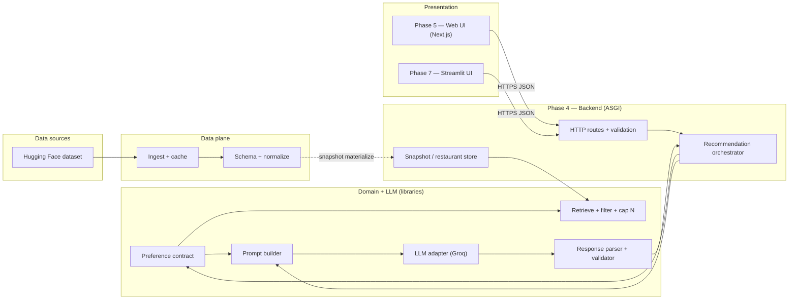
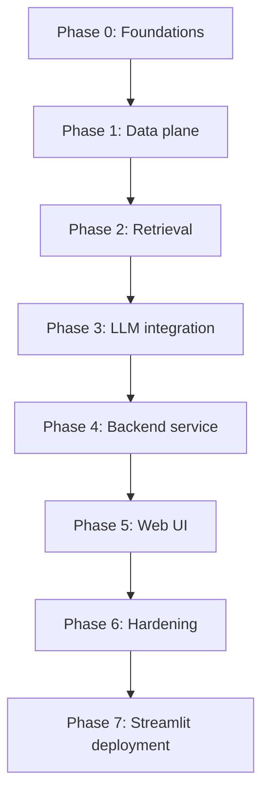

# Phase-wise architecture: AI restaurant recommendations

This document turns the goals in [problemstatement.md](./problemstatement.md) into **ordered phases**, each with a **narrow architecture slice**, **deliverables**, and **exit criteria**. Phases are sequenced so later work depends on stable contracts from earlier phases.

---

## 1. Reference context

- **Data:** [ManikaSaini/zomato-restaurant-recommendation](https://huggingface.co/datasets/ManikaSaini/zomato-restaurant-recommendation) (Hugging Face).
- **Flow:** ingest → normalize → collect preferences → filter/rank candidates → LLM (rank + explain, grounded in candidates only) → present results.

---

## 2. Target logical architecture (end state)

At a high level, the system is four cooperating layers plus one or more **presentation** options (Next.js and/or Streamlit) calling the same API.

**Backend boundary:** the ASGI app owns configuration, dataset paths, Groq credentials, timeouts, and request/response contracts. **Phase 1–3 modules** remain importable libraries called by the orchestrator—not HTTP-aware themselves.

**Cross-cutting concerns** (apply from Phase 1 onward; enforce in Phase 4+): configuration, structured logging, correlation IDs, and clear error types when the dataset or LLM is unavailable.

---

## 3. Phase overview

| Phase | Name | Primary outcome |
|-------|------|------------------|
| 0 | Foundations | Runnable project, config, dependency boundaries |
| 1 | Data plane | Versioned internal schema, clean tables/frames, reproducible ingest |
| 2 | Retrieval | Deterministic filter + candidate cap; no LLM required |
| 3 | LLM integration | Grounded rank + explanations (e.g. Groq); parse back to structured results |
| 4 | Backend service | Proper HTTP API: orchestration, validation, errors, secrets on server only |
| 5 | Web UI | Browser client that calls the backend; no business logic or keys in the browser |
| 6 | Hardening | Quality checks, limits, production ops, documentation |
| 7 | Streamlit + deploy | Streamlit UI (Phase 7); **recommended split:** [Railway](https://railway.app) FastAPI + [Streamlit Cloud](https://share.streamlit.io) UI; optional all-in-one Streamlit |

Phases 2–4 can overlap slightly once Phase 1’s schema is stable, but **do not** send arbitrary rows to the LLM until Phase 2’s candidate set is bounded and validated. The **web UI and Streamlit client must not bypass** the backend: all recommendation traffic goes through Phase 4.

---

## 4. Phase 0 — Foundations

**Goal:** A minimal repo layout and runtime so all later code shares the same assumptions.

**Architecture**

- Single language/runtime (e.g. Python 3.11+) with one entry module or package.
- Configuration: env vars or a small config file for dataset id, cache directory, LLM settings (Groq from Phase 3 onward), and `MAX_CANDIDATES_FOR_LLM`. **Production keys are consumed by the Phase 4 backend**, not the browser.
- Optional: `Makefile` or task runner for `ingest`, `recommend`, `test`.

**Deliverables**

- Dependency manifest (e.g. `requirements.txt` or `pyproject.toml`).
- `.env.example` (no secrets committed).
- Documented commands to run a no-op or health check.

**Exit criteria**

- A new developer can install deps and run one documented command successfully.

---

## 5. Phase 1 — Data plane

**Goal:** Turn the raw Hugging Face dataset into a **stable internal model** suitable for filtering and for serialization into prompts.

**Architecture**

- **Ingest module:** load dataset (streaming or download-to-cache if large).
- **Canonical schema:** explicit types for name, location/region, cuisines (list or normalized string), cost or cost band, rating, and optional columns you keep for explanations.
- **Normalization:** handle missing ratings/costs, dedupe rules if needed, single representation for “city” vs “locality” depending on actual columns.
- **Artifact (optional):** write a Parquet/JSONL snapshot for faster repeat runs and CI.

**Deliverables**

- Schema definition (types + field mapping from raw columns).
- One function or pipeline: `load_restaurants() -> list[Restaurant]` (or equivalent).
- Basic data quality report (row counts, null rates for key fields).

**Exit criteria**

- All downstream code consumes only the canonical type, not raw HF row shapes.
- Ingest is reproducible (pinned dataset revision or cached snapshot).

---

## 6. Phase 2 — Retrieval (filter + cap)

**Goal:** Implement the **non-LLM** path: map user preferences to a **bounded candidate list** from the dataset only.

**Architecture**

- **Preference DTO:** structured object matching the problem statement table (location, budget band, cuisine, min rating, optional notes).
- **Filter engine:** composable predicates (location match, rating ≥ threshold, cuisine overlap, budget mapping per your ADR).
- **Candidate cap:** after filters, sort by a deterministic score (e.g. rating, tie-break by name) and take top *N* (configurable).
- **Traceability:** each candidate carries stable ids or names so Phase 3 can forbid hallucinated venues.

**Deliverables**

- `filter_restaurants(prefs, restaurants) -> list[Restaurant]` with tests on synthetic fixtures.
- Documented budget → cost mapping (stub acceptable if dataset columns are ambiguous, but behavior must be explicit).

**Exit criteria**

- Given preferences, output is always a subset of ingested rows.
- Empty result path is defined (message to user, no LLM call or guarded LLM path).

---

## 7. Phase 3 — LLM integration

**Goal:** Rank and explain **only** among Phase 2 candidates; return structured output aligned with the product contract.

**Architecture**

- **Prompt builder:** system + user sections; include serialized candidate table (JSON or markdown table) and explicit instruction: do not introduce restaurants not in the list.
- **LLM adapter:** single interface (`complete` / `chat`) swappable between providers; **current implementation: Groq** (OpenAI-compatible HTTP API).
- **Structured output:** prefer JSON schema / tool calling / constrained parsing so you get ordered ids and explanation text per item.
- **Validator:** reject responses that reference unknown names or wrong counts; fallback: repair prompt or degrade to deterministic order with template explanations.

**Deliverables**

- Prompt templates versioned in code or files.
- Parser + validation tests (including “model tries to add a restaurant” fixture).
- Config: model name, temperature, max tokens.

**Exit criteria**

- Parsed recommendations are joinable back to canonical `Restaurant` records.
- Explanations are present for each surfaced top-*k* result.

---

## 8. Phase 4 — Backend service (proper HTTP API)

**Goal:** Turn Phases 1–3 into a **real server-side application**: one place for HTTP contracts, validation, orchestration, errors, and secrets. The CLI can remain for ops, but **product traffic** is defined here.

**Architecture (suggested stack — adjust via ADR)**

- **Runtime:** Python **ASGI** app (e.g. **FastAPI** + **Uvicorn**): async-capable, OpenAPI generation, pydantic request/response models mirroring `UserPreferences` and ranked results.
- **Layers (top → bottom):**
  - **Routes / controllers:** map HTTP paths and query/body JSON to DTOs; never call Groq or read Parquet directly.
  - **Services / use cases:** e.g. `RecommendationService.recommend(body) -> RecommendationResponse` that:
    1. Loads canonical restaurants from a **`RestaurantRepository`** (Parquet snapshot path from settings; optional warm cache at startup).
    2. Calls **Phase 2** `filter_restaurants`.
    3. If `candidate_count == 0`, returns structured empty payload **without** calling the LLM.
    4. Otherwise calls **Phase 3** `rank_with_groq` (Groq) and returns ranked rows + metadata (`used_fallback`, `prompt_version`, latency optional).
  - **Infrastructure:** settings binding (`pydantic-settings`), HTTP client lifecycle (reuse Groq/OpenAI client if needed), file paths, optional background task for periodic ingest refresh (later).
- **API contract:** stable JSON schema for:
  - `POST /v1/recommendations` (or `GET` with query params if you prefer idempotency for simple demos—prefer **POST** for rich bodies and future auth).
  - Errors: **4xx** validation, **404** snapshot missing, **502**/typed **5xx** body when Groq fails after retries (never leak stack traces to clients).
- **Security:** `GROQ_API_KEY` and dataset paths exist **only** in server env; CORS allowlist for the web origin; optional rate limiting and request size caps; no echo of secrets in logs.
- **Observability (minimal in Phase 4, expanded in Phase 6):** request id, route, `candidate_count`, Groq latency, `used_fallback`—**no** raw user notes in logs unless approved.

**Deliverables**

- Runnable ASGI app + documented `uvicorn` / Docker command.
- OpenAPI spec (generated or checked in CI).
- Integration test hitting the API with a **fixture snapshot** (small Parquet) and **mocked Groq**—no network in default CI.

**Exit criteria**

- A client can obtain ranked restaurants + explanations **only** via HTTP, using the same semantics as the problem statement pipeline.
- Misconfiguration (missing snapshot, missing Groq key) returns **predictable JSON errors**, not opaque 500 HTML.

---

## 9. Phase 5 — Web UI (browser client)

**Goal:** Expose the full path from [problemstatement.md](./problemstatement.md): collect inputs → show name, cuisines, rating, cost, explanation. The **frontend is a web application** (browser); it is **not** a CLI, **not** a native desktop app, and **not** a native mobile app.

**Architecture**

- **Web client:** forms or controls for preferences (location, budget band, cuisine, min rating, optional notes), loading and error states, and a results view (cards/list) for recommendations and explanations.
- **Transport:** call **only** the Phase 4 backend (`fetch` / axios) over HTTPS in production; **no** Groq keys, dataset paths, or Parquet reads in the browser.
- **Dev ergonomics:** Vite/React (or similar) dev server **proxy** to the ASGI backend to avoid CORS pain locally; production CORS restricted to the deployed UI origin.
- **Presentation:** map API JSON to UI components; handle empty results and validation errors from the API’s structured error body.

**Deliverables**

- Deployable or locally runnable **web UI** plus documented **backend URL** configuration.
- Input validation errors surfaced clearly in the UI (and consistent error shape from the API).

**Exit criteria**

- End-to-end demo in the **browser** matches the success criteria in the problem statement (input → filter → LLM → ranked list with explanations), with all model calls originating from the **backend**.

---

## 10. Phase 6 — Hardening and operations

**Goal:** Close the “open design choices” from the problem statement with measured defaults and production-grade operations.

**Architecture**

- **Observability:** metrics (latency, error rate, Groq token usage if available), structured logs with correlation id (no PII unless approved).
- **Guardrails:** timeouts, retries with backoff for Groq, max prompt size tied to `MAX_CANDIDATES_FOR_LLM`, circuit breaker optional.
- **Regression suite:** snapshot tests for filter + parser; contract tests for API + mocked LLM.
- **README / ADR:** API deployment, budget mapping, candidate cap, Groq model choice, and rotation process for keys.

**Deliverables**

- Documented limits and failure modes.
- Optional: simple evaluation rubric (human or LLM-as-judge) for explanation quality—document limitations.

**Implementation notes (this repo)**

- Operator guide: [`docs/operations.md`](./operations.md); ADR: [`docs/adr/001-configuration-and-limits.md`](./adr/001-configuration-and-limits.md).
- API: `GET /metrics` (Prometheus text), extended `GET /health`, merged access logging with `X-Request-ID`, optional `API_RATE_LIMIT_PER_MINUTE`, Groq timeout/retries, `LLM_MAX_PROMPT_CHARS` → **413** `prompt_too_large`, token usage in logs and `groq.*_tokens` when the provider returns usage.

**Exit criteria**

- Operators know how to change model, dataset revision, API replicas, and caps without code archaeology.

---

## 11. Phase 7 — Streamlit UI and deployment

**Goal:** Ship a **Python-native** browser UI that completes the problem-statement path (preferences → ranked list with explanations). **Recommended production split:** host **Phase 4 FastAPI on [Railway](https://railway.app)** and **Streamlit on [Streamlit Community Cloud](https://share.streamlit.io)** — Streamlit calls the API with **server-side `httpx`** (`BACKEND_MODE=http`, `BACKEND_URL` = Railway public URL). **Alternative:** **all-in-one** Streamlit Cloud (in-process `RecommendationService`, no separate host) for demos or minimal ops.

**Architecture**

- **Streamlit (frontend):** `st.form` / widgets for the same preference fields as [problemstatement.md](./problemstatement.md) (location, budget, cuisine, min rating, optional notes, include-unknown-cost, optional max candidates); `st.spinner` / `st.error` for loading and API error bodies (`error`, `message`, `detail`).
- **Railway (backend):** Run **Uvicorn + `phase4.app`** as a web service. Railway provides a **public HTTPS URL**; set **`GROQ_API_KEY`**, **`RESTAURANT_SNAPSHOT_PATH`** (or bake Parquet into the image), and optional Phase 6 env vars on the Railway service — **not** in Streamlit when using split mode.
- **Transport (split deploy):** Streamlit uses **`httpx`** from the Streamlit process to `POST {BACKEND_URL}/v1/recommendations`. **No** Groq keys or Parquet paths in Streamlit secrets for split mode (only `BACKEND_URL` + `BACKEND_MODE=http`). **CORS:** not required for browser→API when using server-side `httpx`; if you ever call the API from the browser, add Streamlit’s origin to `CORS_ORIGINS` on Railway.
- **Configuration:** `BACKEND_URL` / `API_BASE_URL` in Streamlit secrets; `BACKEND_MODE=http` for Railway split. **All-in-one:** `BACKEND_MODE=local` + `GROQ_API_KEY` (+ optional `INGEST_LIMIT`) in Streamlit secrets — see [`streamlit-deploy.md`](./streamlit-deploy.md).
- **Relationship to Phase 5:** Phase 5 (Next.js) and Phase 7 (Streamlit) are **alternative or complementary** UIs; both consume Phase 4. Phase 6 guardrails apply on whichever host runs the ASGI app (Railway or in-process).

**Deliverables**

- Documented **Railway → Streamlit** flow: repo root service, build/start, env vars, health check, then Streamlit secrets pointing at the Railway URL.
- Runnable Streamlit entrypoint (`streamlit_app/app.py`) and optional **Procfile** (or equivalent) for Railway Uvicorn.
- Ops checklist: API reachable from Streamlit Cloud egress; snapshot + Groq on Railway only for split mode.

**Implementation (this repo)**

- **Split (Railway + Streamlit):** Root **`Procfile`** for `web: uvicorn … --port $PORT`. **`requirements-api.txt`** on Railway build. Streamlit sidebar **Remote HTTP API** or secrets `BACKEND_MODE=http`, `BACKEND_URL=https://…up.railway.app`.
- **All-in-one Streamlit:** `streamlit_app/local_backend.py`, `bootstrap.py`, root **`requirements.txt`** with full stack; see [`streamlit-deploy.md`](./streamlit-deploy.md).
- `streamlit_app/client.py` — `run_recommendations()` routes **local** vs **http**.

**Exit criteria**

- A user completes the pipeline via Streamlit; with **split deploy**, all LLM and dataset access stay on the **Railway** FastAPI service. With **all-in-one**, they stay in-process on Streamlit Cloud.

---

## 12. Phase dependency diagram

Phase 7 is placed **after** Phase 6 so API limits, metrics, and ops docs are stable before shipping the Streamlit surface. **Recommended split:** FastAPI on **Railway**, UI on **Streamlit Cloud** (`BACKEND_MODE=http`). **Alternative:** all-in-one Streamlit (`BACKEND_MODE=local`) without Railway.

---

## 13. Optional later phases (out of current scope)

- **Caching:** embed user queries or restaurant snippets for semantic pre-filtering (adds vector store and MLOps).
- **Online data:** live menus or hours (violates current non-goals unless the problem statement is extended).
- **Personalization:** user accounts and history (new data model and privacy review).

---

## 14. Traceability to the problem statement

| Problem statement area | Primary phase |
|------------------------|---------------|
| Dataset ingest + fields | 1 |
| User input contract | 0 (DTO), 4 (API models), 5 (web forms), 7 (Streamlit widgets) |
| Filter + cap N | 2 |
| LLM rank + explain, grounded | 3 |
| Output fields | 3–5, 7 |
| Open design choices (stack, budget map, N) | 0, 2, 6 |
| Secrets + transport security | 4–6 |
| Alternative UI / Streamlit + Railway deploy | 7 |

For the authoritative product description, use [problemstatement.md](./problemstatement.md); this file is the **implementation roadmap and module boundary** view.
